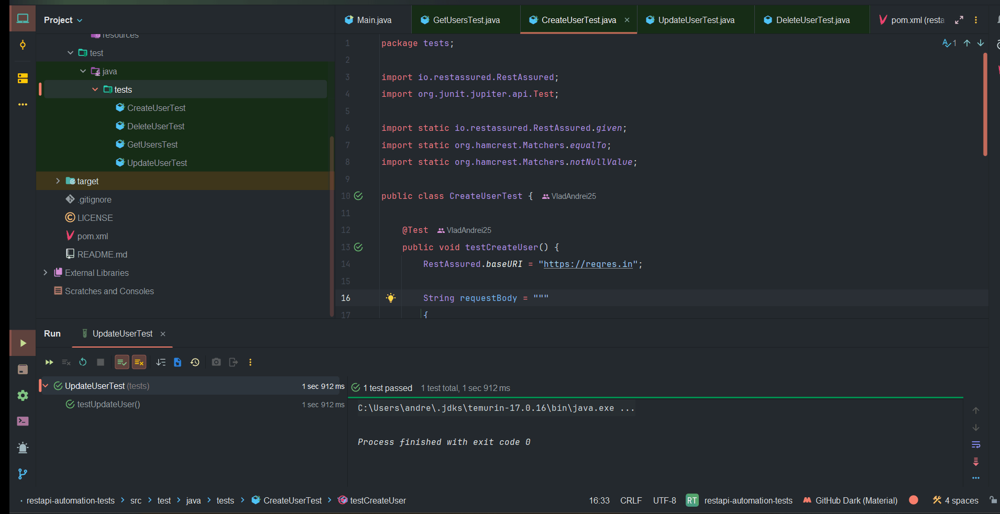

# 🧪 REST API Automation Tests – ReqRes

Automated testing project for the **ReqRes API** using **Java**, **RestAssured**, and **JUnit 5**.  
The goal of this project is to demonstrate CRUD (Create, Read, Update, Delete) operations on a RESTful API.

---

## 🚀 Project Overview

This project validates the functionality of public API endpoints from [reqres.in](https://reqres.in)  
using automated tests written in Java. It focuses on verifying the correctness of HTTP methods,  
status codes, and response payloads.

### ✅ Implemented CRUD Tests

| Operation | HTTP Method | Endpoint | Test Class | Status |
|------------|-------------|-----------|-------------|--------|
| Create User | `POST` | `/api/users` | `CreateUserTest.java` | ✅ |
| Read Users | `GET` | `/api/users?page=2` | `GetUsersTest.java` | ✅ |
| Update User | `PUT` | `/api/users/2` | `UpdateUserTest.java` | ✅ |
| Delete User | `DELETE` | `/api/users/2` | `DeleteUserTest.java` | ✅ |

Each test includes:
- Proper **status code validation**
- **Response body assertions** (using Hamcrest)
- Basic **JSON payloads** for POST and PUT requests

---

## 🧰 Tech Stack


| Tool / Library | Purpose |
|----------------|----------|
| **Java 17** | Programming language |
| **Maven** | Build automation & dependency management |
| **JUnit 5** | Test framework |
| **RestAssured** | API testing library |
| **Hamcrest** | Assertions and matchers |

---

## ⚙️ Project Structure
```restapi-automation-tests/
├── src/
│ └── test/
│ └── java/
│ └── tests/
│ ├── CreateUserTest.java
│ ├── GetUsersTest.java
│ ├── UpdateUserTest.java
│ └── DeleteUserTest.java
│
├── pom.xml
├── .gitignore
└── README.md
```

---

## 🧪 How to Run the Tests

1. **Clone the repository:**
   ```bash
   git clone https://github.com/VladAndrei25/restapi-automation-tests.git
   cd restapi-automation-tests
   ```
2. **Run tests via Maven:**
   ```bash
   mvn test
   ```
3.**Run a specific test example:**
   ```bash
   mvn -Dtest=CreateUserTest test
   ```

---

## 🧠 Included Test Cases
- CreateUserTest
- DeleteUserTest
- GetUserTest
- UpdateUserTest

---

## 📸 Screenshots
Example of successful test execution in CreateUserTest:
<p align="center">
 
</p>
Example of succesful test execution in GetUserTest:
<p align="center">
  
</p>
Example of succesful test execution in UpdateUserTest:
<p align="center">
 
</p>
Example of succesful test execution in DeleteUserTest:
<p align="center">
  
</p>

---

## 🎥 Demo – Test Execution

<div align="center">



</div>

---

 ## 💡 Future Improvements
 Add request/response logging for better visibility (.log().all())
 
 Integrate with Allure for test reporting

 Parameterize test data
 
 Add negative test scenarios (invalid inputs)
 
 Add CI/CD integration with GitHub Actions

---

### 🧾 License

This project is licensed under the [MIT License](LICENSE)

---

## 👤 Author
Radulescu Vlad Andrei

📧 GitHub Profile: [https://github.com/VladAndrei25]

💬 Feel free to reach out for collaboration or feedback!

---
